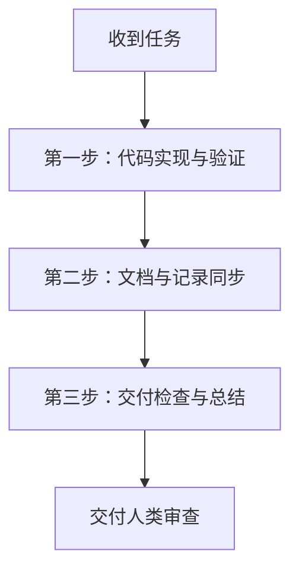

# 项目工程规范

> **版本**：1.1.0
> **更新时间**：2026-06-24


## 🧭 核心规范落地指南

### 1. 仓库即记录系统（Repo as System of Record）

> 不在仓库里的东西，对智能体不存在

**核心实践：**
1. 一切架构决策、设计取舍必须以 Markdown 提交到 `docs/`和所有的 API 设计、数据库 Scheme 变更、重构方案必须沉淀到 `docs/` 目录下（如 `docs/specs/`, `docs/designs/`）
2. 黄金规则代码化：代码规范不应仅仅是一份说明，必须转译为 `.editorconfig`, `detekt.yml` 或自定义 Lint 规则
3. 实施路径双向同步：Agent 的每一次架构修改，必须伴随对应设计文档的更新
4. 变更有迹可循, [CHANGELOG.md](CHANGELOG.md) 记录每个版本的重要变更


### 2. 渐进式上下文管理 (Progressive Context Management)

> 为了防止 Agent 的上下文窗口被无关代码或过于庞大的规则文档污染（导致推理延迟和精度下降），本项目采用**渐进式披露（Progressive Disclosure）**原则。


我们建立两层导航结构：
1. **全局导航入口：`AGENTS.md`**  
   它是一个“地图”。它负责告诉 Agent 项目的基本技术栈（KMP、Compose、Koin、Ktor、Sandwich、LiteRT），并引导 Agent 去哪里寻找详细规范。
2. **细分领域手册：`docs/agents/` 目录**
```
└── docs/
    ├── code-style-guide.md        # [always_on] 必须加载的编码规范
    └── agents/                     # 分域 Agent 上下文目录
        ├── ui-theme.md             # Ethereal Minimalism 设计系统、色彩渐变、毛玻璃效果、圆角与间距 Token 细则
        ├── i18n-guide.md           # 多语言资源键名规范与 Compose 引用方式
        ├── data-model.md           # 定义系统的数据载体
        └── native-cpp.md           # Gemma/LiteRT JNI 的面向对象调用、C++ 底层内存与指针生命周期管理
```


> 按需加载（On-demand Loading）**：Agent 在执行特定任务时，必须通过查看目录结构，主动且仅加载与当前任务相关的细则文档（例如，只有在修改 UI 时才加载 `ui-theme.md`）。**严禁**一次性将所有文档读入上下文。


### 3. 智能体任务交付标准 (Definition of Done - DoD)

智能体在完成任何编程任务时，**必须且只能**在满足以下交付标准后方能向人类报告完成。未完成文档同步的变更，一律视为“任务未完成”。

#### 📋 任务执行三步走协议（强制执行）



1. **第一步：代码实现与验证**
   * 按照编码规范编写/修改代码，并通过编译及核心逻辑自测。
2. **第二步：文档与记录同步（核心原则落地）**
   * 检查修改是否涉及：数据结构（Schema）、公共接口、API、新页面或架构设计。如果是，**必须**在 `docs/`（如 `docs/specs/`, `docs/designs/` 或 `docs/agents/`）中更新或新建对应的 Markdown 说明。
   * **必须**更新 `CHANGELOG.md`，追加一条以当前日期开头的版本变更记录，格式如下：
     ```markdown
     ## [2026-06-24] - 任务/功能简述
     - [新增/修复/修改] 详细说明具体做出的改动及涉及的类与文件。
     ```
3. **第三步：交付检查与总结**
   * 在最终向人类回复时，必须以单独的 **「交付清单」** 形式汇报：
      - [ ] 代码修改列表及影响范围
      - [ ] `docs/` 下被更新或创建的 Markdown 文件路径
      - [ ] `CHANGELOG.md` 更新状态

---

> [!NOTE]
> 本规范应随着项目演进持续更新。当引入新模块、新约束或新反馈回路时，**必须**同步更新本文档。
> 规范腐烂 = 智能体行为漂移。

